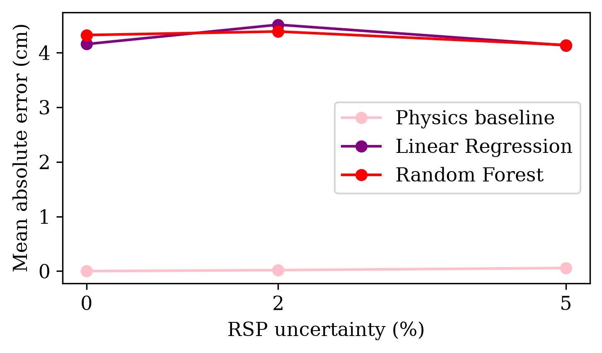

# Benchmarking Machine Learning Against Physics-Based Proton Range Prediction Under RSP Uncertainty

A computational medical physics project comparing simple machine-learning models with a physics-based proton transport model for range prediction under relative stopping power (RSP) uncertainty.

The project investigates whether Linear Regression and Random Forest models using global features of heterogeneous tissue profiles can reproduce proton ranges obtained from a one-dimensional physics-based transport calculation.

## Motivation

Accurate proton range prediction is important in proton therapy because uncertainty in tissue stopping power can affect the predicted location of the proton stopping point.

Machine learning is increasingly investigated for applications in proton therapy, but its performance should be assessed relative to established physics-based approaches.

This project therefore uses a controlled computational benchmark to compare simple ML models with a proton transport calculation under increasing RSP uncertainty.

## Methodology

The workflow consists of:

1. Loading proton stopping-power data for liquid water from the NIST PSTAR database.
2. Implementing a one-dimensional continuous slowing-down proton transport model.
3. Validating the transport model against the NIST CSDA range in homogeneous water.
4. Generating synthetic 40 cm heterogeneous RSP profiles containing lung, soft tissue and bone.
5. Applying 0%, 2% and 5% multiplicative Gaussian RSP noise.
6. Calculating the true proton range from the unperturbed profile and the physics-based prediction from the noisy profile.
7. Training Linear Regression and Random Forest models using five global features.
8. Comparing the models using MAE, RMSE, $R^2$ and maximum absolute error.

## Machine-learning inputs

The ML models receive five global features derived from each noisy RSP profile:

- Initial proton energy
- Water-equivalent thickness (WET)
- RSP standard deviation
- Lung fraction
- Bone fraction

The full spatial RSP profile and the physics-based range prediction are not provided to the ML models.

## Results

| RSP noise | Model | MAE (cm) | RMSE (cm) | R² |
|---:|---|---:|---:|---:|
| 0% | Physics baseline | 0.000 | 0.000 | 1.000 |
| 0% | Linear Regression | 4.155 | 5.149 | 0.625 |
| 0% | Random Forest | 4.321 | 5.485 | 0.574 |
| 2% | Physics baseline | 0.019 | 0.045 | 1.000 |
| 2% | Linear Regression | 4.511 | 5.451 | 0.665 |
| 2% | Random Forest | 4.387 | 5.793 | 0.622 |
| 5% | Physics baseline | 0.057 | 0.095 | 1.000 |
| 5% | Linear Regression | 4.132 | 5.052 | 0.656 |
| 5% | Random Forest | 4.139 | 5.368 | 0.611 |

The physics-based model remained highly accurate across all tested RSP uncertainty levels.

In contrast, both ML models produced MAEs of approximately 4–4.5 cm. Similarly large ML errors were already present at 0% RSP noise. This suggests that the dominant limitation was not the applied RSP uncertainty, but the reduction of the heterogeneous spatial profile to a small set of global features.

The Random Forest did not substantially outperform Linear Regression, indicating that increased model non-linearity alone was insufficient to recover the spatial information lost during feature extraction.

### Performance under RSP uncertainty

The physics-based model remains substantially more accurate than either ML approach across the tested uncertainty range.

A detailed description of the project is available in the [project report](report/proton_range_prediction_report.pdf).
